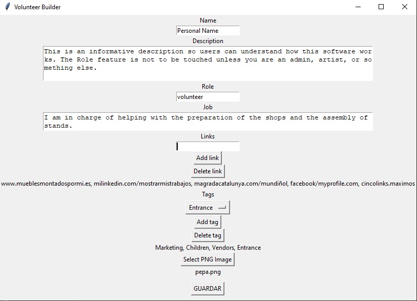
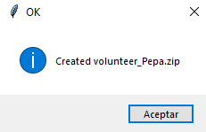
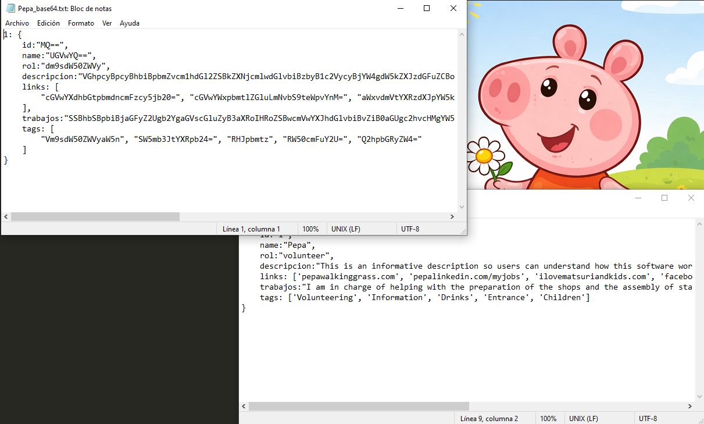
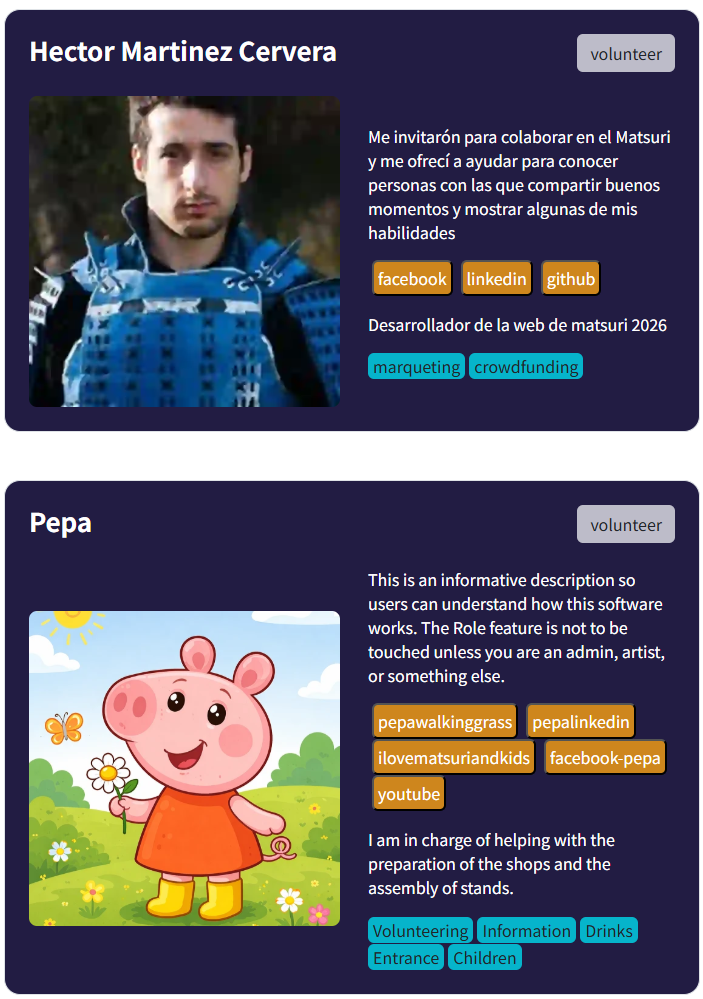

# 🌟 How to Add Your Profile to the Matsuri Website

If you want your profile to appear on the website, please download the program **`volunteer_builder.exe`**.  
This tool lets you add all the information you want to share publicly. Its main purpose is to **encode your personal information** before it appears on the web.

---

---

## 📝 Step-by-Step Guide

### 1️⃣ Your Name and Description
- At the top, enter your **name** (max 40 characters).  
- Write a short **description** about yourself (max 255 characters).  
- Select your **role** in Matsuri. By default, this should be **"Volunteer"**.

---

### 2️⃣ Adding Links 🌐
- Add links to your profiles or websites so people can find more about you (LinkedIn, personal page, etc.).  
- Click **`Add link`** to include each URL.  
- You can add up to **5 links**.  
- Make sure the URL is complete, including `http://` or `https://`.  
- If you make a mistake, click **`Delete link`** to remove the last one.  

> Example: `https://www.linkedin.com/in/yourname`

---

### 3️⃣ Tags 🏷️
- Click the dropdown menu to select **the sections you have participated in**, like:  
  **Admin, Logistics, Sponsors, Marketing, Program, Institutions, Vendors, Catering, Volunteering, Crowdfunding, Information, Drinks, Children, Entrance**  
- You can select up to **5 tags** to keep the layout clean.  
- If you select the wrong tag, you can remove the **last one added**.

---

### 4️⃣ Upload Your Photo 🖼️
- Upload a photo that identifies you.  
- Both **name** and **photo** are **mandatory**.  
- The photo must be **smaller than 500 KB**. If it’s too large, an alert will appear, and the image won’t be saved.  

---

---

## ✅ After Completing the Form

1. The program will generate a **ZIP file** containing your information.  
2. Send the ZIP to the web developer.  
3. The developer will add your profile to the website, and a card will automatically be created using your details.  

---

---

### 💡 Tips & Recommendations

- Include information about yourself, the section you participated in, what you did at Matsuri, your photo, etc.  
- This section **will not be translated**, so choose the language you prefer.  
- Before sending the ZIP, **double-check all information**.  

Thank you for helping make the Matsuri website **complete and up-to-date!** 🎉

### The result
---

---

- After you’ve prepared your ZIP file, the developer will use it to show your profile on the website – just like this! 🌟

